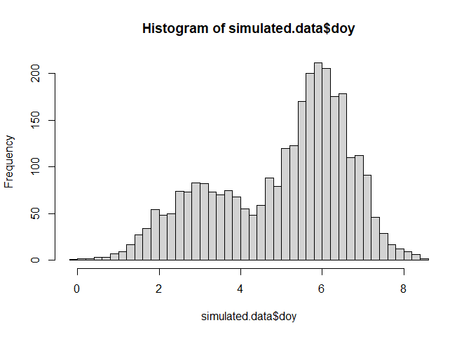

Rmixmod quickstart
================
28/01/2021

A quick example of code to get started with fitting a finite Gaussian
mixture model (here with just 2 clusters).

## Load `Rmixmod` library

``` r
library(Rmixmod)
```

    ## Loading required package: Rcpp

    ## Rmixmod v. 2.1.5 / URI: www.mixmod.org

## Simulate data

``` r
set.seed(84)
simulated.data<- data.frame(doy= c(rnorm(1000, mean= 3, sd= 1), rnorm(2000, mean= 6, sd= 0.8)))

hist(simulated.data$doy, nclass= 50)
```

<!-- -->

## Estimate a finite Gaussian mixture model with 2 clusters

``` r
nclass<- 2

dat4EM1<- na.omit(simulated.data[, c("doy")]) # making a copy with just the covariates of interest (not required)

DD.EM1 <- mixmodCluster(dat4EM1, nbCluster= nclass, 
    models = mixmodGaussianModel(), criterion= c("BIC","ICL"), 
    strategy= mixmodStrategy(algo= "EM", nbTry= 1, 
        initMethod= "smallEM", nbTryInInit= 50, 
        nbIterationInInit= 5, nbIterationInAlgo= 200, 
        epsilonInInit= 0.001, epsilonInAlgo= 0.001), 
    seed= 45)
```

## A few outputs from the model:

``` r
# show a summary of the best model containing the estimated parameters , the likelihood
summary(DD.EM1)
```

    ## **************************************************************
    ## * Number of samples    =  3000 
    ## * Problem dimension    =  1 
    ## **************************************************************
    ## *       Number of cluster =  2 
    ## *              Model Type =  Gaussian_pk_Lk_C 
    ## *               Criterion =  BIC(10759.8586) ICL(11434.3488)
    ## *              Parameters =  list by cluster
    ## *                  Cluster  1 : 
    ##                          Proportion =  0.6653 
    ##                               Means =  6.0014 
    ##                           Variances =  0.6293 
    ## *                  Cluster  2 : 
    ##                          Proportion =  0.3347 
    ##                               Means =  3.0402 
    ##                           Variances =  0.9809 
    ## *          Log-likelihood =  -5359.9134 
    ## **************************************************************

> Note that the order of the clusters is random, but the simulated
> parameters are estimated pretty well.

## Plot the estimated model

``` r
hist(DD.EM1) # default Rmixmod plot
```

    ## [1] 1

<!-- -->

``` r
# plot(DD.EM1) if more than one cluster predictor
```

## Doing our own plot to compare estimated with data-generating model

``` r
hist(simulated.data$doy, nclass= 50, freq= F)
x.seq<- seq(-4, 15, l= 200) # create a regular sequence along the x-axis

# add the distributions from which the data were generated:
lines(x.seq, dnorm(x.seq, mean= 3, sd= 1) * 1/3, col= 2)
lines(x.seq, dnorm(x.seq, mean= 6, sd= 0.8) * 2/3, col= 3)

# add the estimated distributions:
    # (really awkward parameter extraction from these models: 
    # surely there must be a better way!)
prop.Cluster1<- DD.EM1@bestResult@parameters@proportions[1] 
prop.Cluster2<- DD.EM1@bestResult@parameters@proportions[2]

lines(x.seq, dnorm(x.seq, 
                    mean= DD.EM1@bestResult@parameters@mean[1, ],
                    sd= DD.EM1@bestResult@parameters@variance[[1]][1, 1])
                    * prop.Cluster1, 
            col= 3, lwd= 2, lty= 2)

lines(x.seq, dnorm(x.seq, 
                    mean= DD.EM1@bestResult@parameters@mean[2, ],
                    sd= DD.EM1@bestResult@parameters@variance[[2]][1, 1])
                    * prop.Cluster2,
            col= 2, lwd= 2, lty= 2)
```

<!-- -->

## Extract the cluster assignment probabilities for each observation (obs in rows, clusters in columns)

``` r
head(DD.EM1@bestResult@proba)
```

    ##              [,1]      [,2]
    ## [1,] 4.774383e-02 0.9522562
    ## [2,] 2.269764e-01 0.7730236
    ## [3,] 4.855727e-05 0.9999514
    ## [4,] 5.884160e-06 0.9999941
    ## [5,] 6.319097e-03 0.9936809
    ## [6,] 3.256917e-02 0.9674308

``` r
matplot(DD.EM1@bestResult@proba, 
        xlab= "Observation index",
        ylab= "Group membership probability", 
        type= "p")
```

<!-- -->

``` r
# Most likely cluster membership for each observation (as predicted by the best model)
dat4EM1$EM.class.2<- (DD.EM1@bestResult@partition)

plot(dat4EM1$EM.class.2, 
        xlab= "Observation index", 
        ylab= "Predicted cluster",
        col= dat4EM1$EM.class.2)
legend(x= "right", paste("Cluster", 1:nclass),
        pch = 1, col = 1:nclass, bty= "n")
```

<!-- -->

## Classification “performance”

``` r
trueClass<- rep(LETTERS[1:2], times= c(1000, 2000))

table('True'= trueClass, 'Predicted'= dat4EM1$EM.class.2)
```

    ##     Predicted
    ## True    1    2
    ##    A   71  929
    ##    B 1955   45
